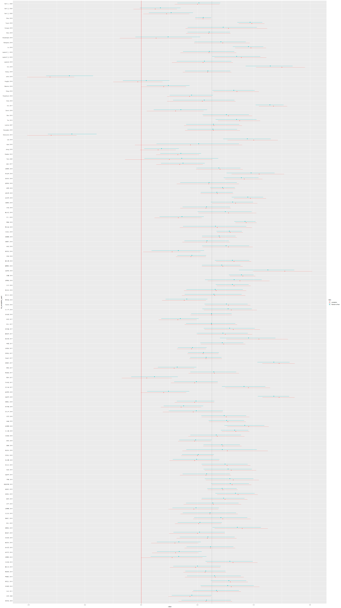

```{r setup, include=FALSE}
knitr::opts_chunk$set(echo = TRUE, message = FALSE, warning = FALSE)
```

需要的包载入
```{r}
library("metafor")
library('rstan')
library("tidyverse")
rstan_options(auto_write = TRUE)
```

# 一般统计方法分析


## 输入数据

```{r}
raw_data <- readxl::read_xlsx('./原始数据信息.xlsx')
```


添加统计量（置信区间）

（公式待添加）
```{r}
meta_data <- raw_data

meta_data$z <- 0.5 * log((1 + meta_data$correlation)/(1 - meta_data$correlation),exp(1))

meta_data$z_se <- sqrt(1 / (meta_data$N - 3))

meta_data$lower <- (exp(2 * (meta_data$z - qnorm(0.975) * meta_data$z_se)) - 1) / (exp(2 * (meta_data$z - qnorm(0.975) * meta_data$z_se)) + 1)

meta_data$upper <- (exp(2 * (meta_data$z + qnorm(0.975) * meta_data$z_se)) - 1) / (exp(2 * (meta_data$z + qnorm(0.975) * meta_data$z_se)) + 1)


meta_analysis_data <- meta_data %>%
  select(author, year, correlation, lower, upper,z,z_se)


```

查看数据：
```{r}
head(meta_analysis_data)
```


## 做出森林图
```{r}
# 对数据排列，方便看图
meta_analysis_data_ordered <- meta_analysis_data[order(meta_analysis_data[,3]),]

png('forest plot.png', 2160, 3840, pointsize = 20)
p <- forest(x = meta_analysis_data_ordered$correlation, 
            ci.lb = meta_analysis_data_ordered$lower, 
            ci.ub = meta_analysis_data_ordered$upper, 
            slab = paste(meta_analysis_data_ordered$author, meta_analysis_data$year, sep = ", "), 
            refline = 0)
text(min(p$xlim),
     1.001 * max(p$ylim), 
     "Author and Year", 
     pos = 4, 
     font = 2
     )
text(max(p$xlim), 
     1.001 * max(p$ylim), 
     "Correlation [95% CI]", 
     pos = 2, 
     font = 2
     )
dev.off()
```

查看森林图：

```{r}
knitr::include_graphics(("./forest plot.png"))
```

## 发表偏差检验
暂略（不会）


## 固定效应模型分析


主效应（相关系数），下区间， 上区间

```{r}
me.re <- rma(meta_analysis_data$z, meta_analysis_data$z_se^2,method = "FE")

effect_p <- (exp(2 * (me.re$b )) - 1) / (exp(2 * (me.re$b  )) + 1)
effect_p_lower <- (exp(2 * (me.re$ci.lb)) - 1) / (exp(2 * (me.re$ci.lb)) + 1)
effect_p_upper <- (exp(2 * (me.re$ci.ub)) - 1) / (exp(2 * (me.re$ci.ub)) + 1)

c(effect_p, effect_p_lower, effect_p_upper)
```


## 异质性检验
采用随机效应模型需要进行异质性检验（真的吗？书里的解释有些微妙）

（暂略）


## 随机效应模型分析

主效应（相关系数），下区间， 上区间

```{r}
me.re <- rma(meta_analysis_data$z, meta_analysis_data$z_se^2,method = "REML")

effect_p <- (exp(2 * (me.re$b )) - 1) / (exp(2 * (me.re$b  )) + 1)
effect_p_lower <- (exp(2 * (me.re$ci.lb)) - 1) / (exp(2 * (me.re$ci.lb)) + 1)
effect_p_upper <- (exp(2 * (me.re$ci.ub)) - 1) / (exp(2 * (me.re$ci.ub)) + 1)

c(effect_p, effect_p_lower, effect_p_upper)
```

## 调节效应检验
暂略（不会）


# 贝叶斯多层模型

假设效应值取样直独立总体，而独立总体取样自共同总体。

## 公式：
$$
\begin{aligned}
y_j &\sim N(\theta_j, \sigma^2_j)  \\
\theta_j &\sim N(\mu, \tau),
\end{aligned}
$$
```{r}
df <- meta_analysis_data
```


stan代码
```{r, warning=FALSE, message=FALSE}
stan_program <- "
data {
  int<lower=1> N;           
  vector[N] y;              
  vector<lower=0>[N] sigma;   
}

parameters {
  real theta[N];          
  real mu;          
  real<lower=0> tau; 
}
model {

  for (i in 1:N) {
    y[i] ~ normal(theta[i], sigma[i]);
  }
  
  theta ~ normal(mu, tau);
  mu ~ normal(0, 1);
  tau ~ cauchy(0, 1);

}
"

# stan数据准备
stan_data <- list(N = nrow(df), 
                  y = df$z, 
                  sigma = df$z_se
                  )


```


```{r, warning=FALSE, message=FALSE}
# 拟合模型
fit_stan <- stan(model_code = stan_program, 
                  data = stan_data,
                  iter = 4000,
                  warmup = 1000
                  )

```


注意，超参数$\mu，\tau$分布（毕竟固定的嘛），对应$\theta$的取值范围

```{r}
super_parameter <- fit_stan %>% 
  tidybayes::gather_draws(mu, tau)


super_parameter$.value <- (exp(2 * super_parameter$.value) - 1) / (exp(2 * super_parameter$.value) + 1)

super_parameter <- super_parameter %>%
  tidybayes::mean_qi()

super_parameter
```


原始数据的相关系数分布
```{r}
raw_analysis_data <- df %>% 
  mutate(
    item = 'correlation',
    author_year = str_c(author, year, sep = ", ")
  ) %>% 
  select(
    author_year, item, .value = correlation,  .lower = lower, .upper = upper
  ) %>% 
  mutate(author_year = fct_inorder(author_year)) 
raw_analysis_data
```


后验数据的效应量分布
```{r}
post_data <- fit_stan %>% 
  tidybayes::gather_draws(theta[i])  %>% 
  mutate(.value = (exp(2 * .value) - 1) / (exp(2 * .value) + 1)) %>% 
  tidybayes::mean_qi(.width = .95) %>% 
  ungroup() %>% 
  bind_cols(
    df %>% 
      mutate(
        author_year = str_c(author, year, sep = ", ") 
      ) %>% 
      select(author_year)
  ) %>% 
  mutate(
    item = 'Random effect'
  ) %>% 
  select(author_year, item, .value, .lower, .upper) %>% 
  mutate(author_year = fct_inorder(author_year)) 

post_data
```


```{r}
tb <- post_data %>% 
  bind_rows(raw_analysis_data)


```


后验概率的$\mu$均值
```{r}
intercept <- fit_stan %>% 
  tidybayes::gather_draws(mu)

  
intercept$.value <- (exp(2 * intercept$.value) - 1) / (exp( 2 * intercept$.value) + 1)

intercept <- intercept %>%
  tidybayes::mean_qi() %>% 
  pull(.value)

intercept
```


```{r}
png('post forest plot.png', 1080 * 2.5, 1920 * 2.5, pointsize = 12)
tb %>% 
  ggplot(aes(x = .value, y = fct_rev(author_year), xmin = .lower, xmax = .upper)) +  
  geom_pointrange(
    aes(color = item),
    position = position_dodge(width = 0.50)
  ) +
  geom_vline(xintercept = intercept,linetype = 'dotted') +
  geom_vline(xintercept = 0, color = 'red')
dev.off()
```


原效应量与后验效应量的森林图对比

红线为0，虚线为$\mu$均值

（反正我是瞎了）
```{r}

```
蓝色点（后验效应量）向均值收缩。收缩幅度受到原研究的不确定性影响($\tau$？)
其中有6篇文献的置信区间不再包含0，有必要进行检查。


6篇文献如下：
```{r}
tb_cor <- tb %>%
  filter(item == "correlation") %>%
  filter(.lower < 0 & .upper > 0) 
filters <- as.character(tb_cor$author_year)

tb_diff <-   tb %>%
  filter(item == 'Random effect') %>%
  filter(.lower >0) %>%
  filter_all(any_vars(. %in% filters))

tb_diff
```


## 主效应
根据已有$\mu,\tau$计算$\theta$

注意：$\theta$为随机分布值，每次计算结果不一样。

```{r}
post <- rstan::extract(fit_stan, permuted = TRUE)

```

```{r}
n.sims <- nrow(post$mu)
theta.new <- rep(NA, n.sims)
for (i in 1:n.sims){ 
  theta.new[i]  <- rnorm(1,  post$mu[i],  post$tau[i]) 
}

```


效应量均值（相关系数）
```{r}
mean(exp(2 * theta.new) - 1 / (exp(2 * theta.new)) + 1)
```

置信区间
```{r}
quantile((exp(2 * theta.new) - 1 / (exp(2 * theta.new)) + 1), probs = c(.025, .5, .975))
```

## 固定效应模型-贝叶斯
待补充


## 调节效应检验-贝叶斯

待补充